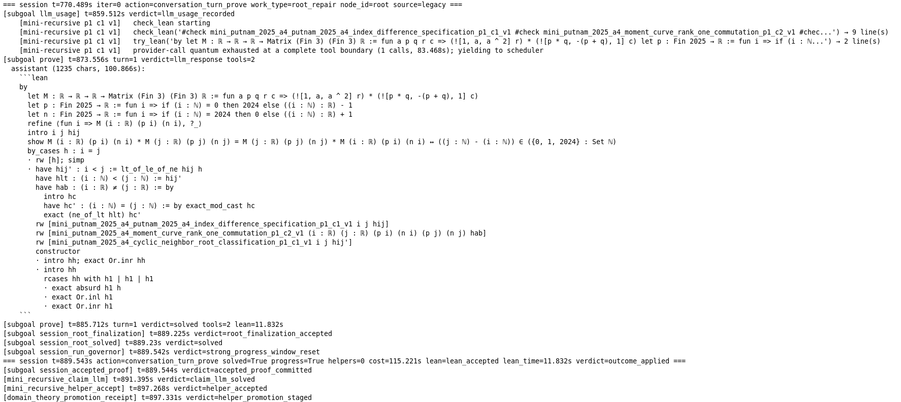

# Ensemble Prover

**Version 1.15 · Research preview** · Updated September 25, 2026

Ensemble Prover is an autonomous theorem prover combining language-model proof
search with Lean 4 verification. Give it a formalized theorem and a compatible
Lean project: it plans, retrieves relevant mathematics, proves helper lemmas,
repairs failed attempts, and checks the final proof with Lean.

[Quick start](#quick-start) · [Workflows](#choose-a-workflow) ·
[Results](#putnam-proofs-accepted-by-putnambench) ·
[User Guide](docs/USER_GUIDE.md) · [Citation](#cite-this-work)

> **Ongoing progress — September 25, 2026:** Ensemble Prover has produced
> Lean-verified proofs for **226 distinct Putnam problems** across research and
> evaluation runs. **65 have been accepted by PutnamBench; the additional 161
> have not yet been independently verified by the PutnamBench team.** Development
> and solving continue, with recent runs using **Astra**, **Fable**,
> **deepseek-v4.1-flash**, and **Opus**. This cumulative count combines models,
> configurations, and budgets; it is not a controlled benchmark solve rate.

## Overview

Proof search combines recursive helper planning, deterministic tactics,
retrieval, falsification, and automatic research when an approach stalls.
Checked helpers and structured run records support reuse and resumption.
Prover, refiner, and planner roles can use one model or different models, with
provider-call, wall-clock, and cost-budget controls.

Experimental workflows also translate natural-language mathematics, develop
multi-file Lean projects, and investigate problems through autonomous research.
**Lean checks the formal proof, not the fidelity of a natural-language
translation. Research reviews and proposed answers are not proof certificates.**

## Choose a workflow

| You have | Start here | What it does |
| --- | --- | --- |
| A Lean theorem and a built Lake project | [Run the prover](#run-the-prover) | Search for and check a proof of the supplied target |
| One natural-language or LaTeX-text claim | [Start from natural language](#start-from-natural-language) | Translate the claim, then try to prove it |
| Longer mathematical notes | [Formalization campaigns](docs/USER_GUIDE.md#19-run-a-multi-file-formalization-campaign) | Build definitions and supporting lemmas across a resumable project |
| A problem to investigate | [Mathematical research](#investigate-a-mathematical-problem) | Explore arguments and counterexamples; optionally formalize and prove candidates |
| An existing Mini run | [Research from a saved run](#start-research-from-a-saved-run) | Start a research run using the saved model, provider, and project |

## Quick start

### Requirements

- Linux
- Standard CPython 3.11 or 3.12
- Lean toolchain compatible with the target Lake project
- An API key for the selected provider, or a ChatGPT Codex / Claude Code
  subscription sign-in for Mini's prover and refiner

The manual research ledger needs neither Lean nor provider credentials.
Autonomous research uses the OpenAI API or Codex subscription sign-in and does not need Lean until the
formalization handoff. Optional Python experiments require Linux bubblewrap
with usable unprivileged user namespaces; there is no unsandboxed fallback.

The public runtime snapshot pins the complete dependency closure for four core
Python packages in `requirements.txt`: HTTP transport, graph search,
environment loading, and YAML parsing. Numerical acceleration, learned
retrieval, provider-specific tokenization, and native SMT bindings are optional
features and are not installed by default.

### Setup

Create the supported virtual environment and install the pinned dependencies:

```bash
./scripts/setup_venv.sh
```

Install Lean and Lake separately using the official
[Lean installation guide](https://lean-lang.org/install/), following the
`lean-toolchain` pin in the theorem project you intend to verify. The release
does not ship or provision Lean, Lake, Mathlib, PutnamBench, or downloaded
package trees.

For API providers, copy the environment template and add only the keys you use:

```bash
cp .env.example .env
```

`.env` is ignored by Git. Never commit provider credentials or generated run
artifacts.

## Run the prover

The live CLI help is authoritative:

```bash
.venv/bin/python -m ensemble_prover.mini_prover --help
```

For an arbitrary Lean theorem project:

```bash
.venv/bin/python -m ensemble_prover.mini_prover \
  --lean-file /path/to/Target.lean \
  --theorem-name MyNamespace.target \
  --project-path /path/to/lake-project \
  --import Mathlib \
  --prover openai
```

Use `--supporting-source-dir` repeatedly when the theorem depends on source
trees outside the target file. `--description` or `--description-file` can add
mathematical context without changing the Lean contract.

For a PutnamBench source file:

```bash
.venv/bin/python -m ensemble_prover.mini_prover \
  --putnam-file external/PutnamBench/lean4/src/putnam_2025_a1.lean \
  --prover openai
```

The Putnam adapter expects a separately supplied compatible PutnamBench
checkout; no benchmark data or setup environment is bundled.

To use a ChatGPT Codex subscription for the prover or refiner, select
`--prover codex --prover-model <model>` and/or
`--refiner codex --refiner-model <model>` after `codex login`.
Set `--cost-budget-usd 0`; subscription usage is not priced as API usage.
See [Codex subscription setup and transport limits](docs/CODEX_SUBSCRIPTION_BACKEND.md).

Claude Code subscription roles are also available with `--prover claude-code`
and/or `--refiner claude-code`, an explicit model such as `--prover-model opus`,
and `--cost-budget-usd 0`. See
[Claude Code setup and transport limits](docs/CLAUDE_CODE_SUBSCRIPTION_BACKEND.md).

To sweep all locally unsolved PutnamBench problems in random order:

```bash
./scripts/sweep_putnam_unsolved.sh \
  --putnam-dir /path/to/PutnamBench/lean4/src \
  -- --prover openai --parallel-samples 2
```

Each attempt must commit one distinct accepted proof by 1,200 seconds and two by
1,800 seconds, both measured from proof worker readiness. Preparation and startup
have a separate 1,200-second cap. After two timely acceptances, normal
budgets apply. See the [sweep guide](ensemble_prover/PUTNAM_SWEEP.md) for a
no-provider-call preview, resume commands, and counting/cleanup rules.

## Ensemble Prover in action

An excerpt from a Putnam 2025 A4 run: declaration checks, a candidate proof,
a yield to the scheduler at a completed tool boundary, and a Lean-accepted
helper proof recorded for reuse.

[](docs/assets/proof-search-mechanics.png)

Click the image to view it at full resolution. This excerpt shows a helper
subgoal being accepted, not final verification of the entire problem. The
screenshot is losslessly cropped; its retained code and logs are unchanged.

## Start from natural language

<details>
<summary>Translate one claim or develop a multi-file formalization campaign</summary>

For one claim, translate and prove using the OpenAI API:

```bash
.venv/bin/python -m ensemble_prover.nl_input \
  --text 'For every natural number n, n + 0 = n.' \
  --project-path /path/to/lake-project \
  --formalizer openai --formalizer-model gpt-5.6-terra \
  -- --prover openai --prover-model gpt-5.6-luna
```

Use `--text-file my_claim.md` for a UTF-8 document. To inspect the generated
statement without proof search, replace the final `-- --prover ...` line with
`--formalize-only`; a successful translation is not a proved theorem.

For longer notes requiring definitions and supporting lemmas, initialize a
resumable campaign:

```bash
.venv/bin/python -m ensemble_prover.formalization init \
  --project-path /path/to/lake-project \
  --source examples/formalization/finite_differences.md \
  --goal 'Formalize and prove the complete theorem in the supplied document.' \
  --output runs/formalization/my_project

.venv/bin/python -m ensemble_prover.formalization run runs/formalization/my_project \
  --max-steps 20 --max-model-calls 60

.venv/bin/python -m ensemble_prover.formalization status runs/formalization/my_project
```

Supply your own built Lean/Lake project with Mathlib and set `OPENAI_API_KEY`.
Campaign formalization and independent review default to `gpt-5.6-terra`;
proof search defaults to `gpt-5.6-luna`, all through OpenAI API name routing.
Repeat `run` to resume. Check for `status: proved` before exporting; exit 0
can also mean a resumable budget pause. Step/request budgets are not dollar
caps, and `--max-model-calls` excludes nested Mini proof-search calls and retries.

Inputs can be plain text, Markdown, LaTeX source, or papers already converted
to UTF-8 text. PDF/OCR extraction and URL downloading are not included. See
the [campaign walkthrough](docs/USER_GUIDE.md#19-run-a-multi-file-formalization-campaign)
for review, revision, budgets, trust boundaries, and export commands.

These modules support long mathematical developments, but autonomous frontier
success rates and FLT/million-line performance have not been established.
Lean verification certifies the formal proof, not the accuracy of translation
from natural language. Review the generated definitions and statements.

</details>

## Investigate a mathematical problem

<details>
<summary>Initialize, run, and resume autonomous research</summary>

For human- or externally coordinated work, the [research ledger
guide](ensemble_prover/research_claims/README.md) walks through recording claims,
arguments, reviews, quantitative requirements, and bounded assignments. The
ledger organizes work; its manual commands do not launch model workers.

For autonomous investigations, supply a complete UTF-8 problem file. No proof
sketch or choice of an affirmative conclusion is required. Add your existing,
built Lean/Lake project to enable the full research-to-proof loop. The default
transport is the OpenAI API; choose model names available to your account:

```bash
# Offline: save the problem and the limits for this research run.
.venv/bin/python -m ensemble_prover.research_claims discovery init runs/research/example \
  --problem problem.md \
  --project-path /path/to/built-lake-project \
  --model gpt-5.6-sol --review-model gpt-6-astra \
  --max-requests 32 --max-seconds 3600 --concurrency 4

# Paid: requires OPENAI_API_KEY; repeat this command to resume.
.venv/bin/python -m ensemble_prover.research_claims discovery run runs/research/example

.venv/bin/python -m ensemble_prover.research_claims discovery status runs/research/example
```

One `discovery run` drives research, formalization, independent statement review,
Mini proof search, checked export, and feedback. The request budget includes all
those roles, nested Mini dispatches, transport retries, and resumed requests.
The wall-clock limit starts at first execution and includes downtime; resuming
does not reset either limit. These are not dollar caps. Omit `--project-path` for
research-only execution. Add `--source notes.md` for supporting text,
`--import Mathlib` for a trusted project import, or `--experiments` for isolated,
bounded Python computations; `--import` requires a project.

For Codex subscription research, run `codex login` using ChatGPT, then add
`--provider codex` at initialization and choose Codex model names. This selects
Codex for research, formalization, proof search, refinement, and both argument
and semantic review, without an API key or API fallback. `--model` selects the
research/formalizer/prover/refiner model; `--review-model` selects both reviewers.
`--review-provider openai` explicitly selects API reviewers instead; the
reverse combination is also supported. One budgeted Codex dispatch is one
`codex exec` invocation, not each internal HTTP request. See
[Codex research setup](docs/CODEX_SUBSCRIPTION_BACKEND.md#autonomous-research).

Workers can wait without model calls and resume when child findings arrive.
Full arguments, feedback, raw responses, and proof plans remain available as
artifacts. Recovery uses bounded working context with exact artifact and page
retrieval; workers must retrieve omitted content before judging it. The Codex
runtime may also manage context internally; exact underlying-model delivery
cannot be attested by this adapter. A reviewed proof or counterexample automatically
queues formalization when a project was configured. Proof work returns feedback
after at most `--proof-quantum-s 600` seconds or `--formalization-steps 8` controller
steps by default; `--lean-timeout-s` defaults to 300 seconds. A worker can continue
the same campaign or submit a revised complete plan for a fresh reviewed campaign.

`supported` means a written argument passed model review. Only an independently
rechecked export can set discovery `root_proved` or `root_refuted`; the latter
requires a formal proof of the original proposition's negation. Natural-language
alignment remains `machine_reviewed_not_certified`. An `idle` run or exit code 0
is not a mathematical success verdict.

Research-only runs can still save an exact handoff for separately authorized
standalone formalization; that separate command's requests are outside the
research cap. New ledgers use schema 7; schemas 1–6 require an explicit upgrade.
Migration preserves providers, budgets, and saved schema-6 closed-loop settings;
it does not authorize strategy recovery on existing ledgers.
There is no established autonomous discovery success rate. Recovery workers can
search Crossref metadata, fetch public primary sources, and inspect original PDF pages;
these tools do not provide comprehensive literature coverage.
See the [research
walkthrough](docs/USER_GUIDE.md#21-run-autonomous-mathematical-research) and
[full execution contract](ensemble_prover/research_claims/DISCOVERY.md).

</details>

## Start research from a saved run

From the repository directory, use one command:

```bash
./research runs/mini_prover/YOUR_RUN
```

This creates and starts integrated research, independent reviews and Lean proof
search using the saved Mini model, provider and project. It prints the new research
directory. New runs default to 4 hours and 200 model calls across all roles;
use `--hours 8 --requests 600` to choose a larger initial budget.

Pass the printed research directory to the same command to resume. Add `--status`
to inspect progress. Resuming preserves the original budget. Add `--prepare` when
creating a run to save it without starting model work, or `--source finding.txt`
to include an outside finding. Saved Codex and OpenAI providers are supported;
other providers require an explicit supported selection.

## Putnam proofs accepted by PutnamBench

Ensemble Prover is listed on the
[PutnamBench leaderboard](https://trishullab.github.io/PutnamBench/leaderboard.html).
The cumulative solve count at the top of this page counts each problem once,
including problems solved more than once or under different configurations.

The following **65 problem identifiers** are the independently accepted subset.
Their Lean proof files were submitted privately to the PutnamBench verification
team on August 31, 2026; PutnamBench has since accepted all 65 proofs. Only the
problem identifiers are published here; the proof files and answers are not.

<details>
<summary>View the 65 accepted problems</summary>

| Period | Problems |
| --- | --- |
| 1960s | `1962 A6`, `1963 B1`, `1964 B1`, `1964 B2`, `1965 A4`, `1965 A6`, `1966 A1`, `1968 A1`, `1968 B2`, `1969 A1` |
| 1970s | `1970 B3`, `1971 A1`, `1971 B1`, `1972 A1`, `1972 A2`, `1973 B2`, `1975 B1`, `1977 A2`, `1977 A3`, `1977 A5`, `1978 A1`, `1978 A4`, `1979 B6` |
| 1980s | `1986 A1`, `1986 B1`, `1986 B6`, `1987 A1`, `1987 A2`, `1988 B1`, `1988 B2` |
| 1990s | `1990 A1`, `1990 A5`, `1990 A6`, `1991 A2`, `1992 A1`, `1992 A2`, `1993 A2`, `1995 A1`, `1996 A3`, `1997 A4`, `1998 B1`, `1998 B2`, `1999 A1` |
| 2000s | `2000 A1`, `2000 B2`, `2001 A1`, `2003 B1`, `2004 A1`, `2004 B2`, `2005 A1`, `2005 B1`, `2006 A1`, `2007 B1`, `2008 A1`, `2009 A1` |
| 2010s | `2010 A2`, `2012 A2`, `2016 A1` |
| 2020s | `2021 A1`, `2021 A2`, `2024 A1`, `2024 B3`, `2025 A1`, `2025 B2`, `2025 B3` |

</details>

## Recent updates

**Version 1.15** improves continuity between proof-search steps and interrupted runs:

- Recursive helper work survives scheduler yields and subscription interruptions.
- Child proofs and root assembly retain their checked, dependency-complete helper context.
- Progress tracking distinguishes new mathematics from equivalent helper and route aliases.
- Provider failures retain their classifications; sustained transport outages pause work
  without treating per-request response limits as account-wide outages.

Automatic research during ordinary Mini runs uses the configured Mini provider
and the existing run budget. Add `--no-autonomous-research` to disable it.
See [automatic recovery](docs/USER_GUIDE.md#automatic-research-when-proof-search-stalls)
and [strategy recovery](ensemble_prover/research_claims/STRATEGY_RECOVERY.md).

Questions with unknown answers remain experimental: Mini can propose and review
terms for `answer(sorry)` slots, then try to prove the exact filled theorem.
See [answer discovery](docs/USER_GUIDE.md#questions-with-an-unknown-answer).

## Documentation

The **[User Guide](docs/USER_GUIDE.md)** covers installation, providers, budgets,
outputs, proof exports, replay, and troubleshooting. Useful starting points:

- [Codex subscription setup](docs/CODEX_SUBSCRIPTION_BACKEND.md)
- [Claude Code subscription setup](docs/CLAUDE_CODE_SUBSCRIPTION_BACKEND.md)
- [Provider, Lean, and wall-clock budgets](docs/USER_GUIDE.md#7-set-time-and-cost-boundaries)
- [Determine whether a run succeeded](docs/USER_GUIDE.md#11-determine-whether-a-run-succeeded)
- [Standalone exports and proof graphs](docs/USER_GUIDE.md#12-standalone-exports-and-proof-graphs)
- [Interruption and replay](docs/USER_GUIDE.md#13-replay-and-interruption-behavior)

Mini proof search and its automatic research support the configured Mini provider,
including Codex and Claude Code subscription transports. The separate autonomous
research CLI and its integrated formalization/proof roles support the OpenAI API
and Codex subscriptions. Standalone NL and formalization CLIs remain API-backed.
Older release snapshots may not include every feature described here.

## Verify a checkout

Verify the installed Python environment and CLI:

```bash
.venv/bin/python -m pip check
.venv/bin/python -m ensemble_prover.mini_prover --help
.venv/bin/python -m ensemble_prover.nl_input --help
.venv/bin/python -m ensemble_prover.formalization --help
.venv/bin/python -m ensemble_prover.research_claims --help
.venv/bin/python -m ensemble_prover.research_claims discovery --help
```

Verify that the user-supplied target project can resolve its own toolchain:

```bash
(cd /path/to/lake-project && lake env lean --version)
```

## Output and local state

By default, runs are written beneath `runs/mini_prover/`. A run may contain a
human-readable log, structured turn records, activation telemetry, proof
artifacts, and a final summary. Generated runs, caches, local environments, and
secrets are excluded by `.gitignore`.

Research state lives in the directory supplied to the research CLI, including
`ledger.sqlite3` and content-addressed artifacts. Keep these records private
when the underlying mathematics is private; they include complete source text
and model conversations.

Persistent Mini theory defaults to `~/.cache/mini_prover/theory`. Use
`--mini-theory-root` to isolate experiments, `--mini-theory-mode read` for
retrieval-only operation, or `--mini-theory-mode off` to disable it.

## Security and trust boundary

Only Lean-accepted artifacts should be treated as proved. Language-model text,
planner receipts, speculative helpers, and falsification probes are search
evidence—not proofs—until independently checked against the target project.

Run the prover on untrusted theorem projects only inside an appropriately
isolated environment. The prover executes Lean and local subprocesses and may
send theorem context to configured external model providers. Provider keys and
common token, secret, password, private-key, cloud-identity, auth-config, and
credential-bearing URL variables are stripped from Lean, Lake, and other
local-tool child environments. Credential-bearing parent and watchdog
processes are also marked non-dumpable on Linux to block descendant `/proc`
inspection. Untrusted Lean code still runs with the prover user's filesystem
and network privileges, so operating-system isolation may still be required. A
Python virtual environment is not a security boundary.

## Cite this work

If you use Ensemble Prover in your research, experiments, or software, please cite:

> Reale, M. (2026). *Ensemble Prover* (Version 1.15) [Computer software]. Graviterra.
> [GitHub repository](https://github.com/graviterra/ensemble-prover).

```bibtex
@software{reale2026ensembleprover,
  author       = {Reale, M.},
  title        = {{Ensemble Prover}},
  year         = {2026},
  version      = {1.15},
  organization = {Graviterra},
  url          = {https://github.com/graviterra/ensemble-prover}
}
```

For reproducibility, please also identify the release or commit used.
Machine-readable citation metadata is available in [CITATION.cff](CITATION.cff).

## Contributing and licensing

See [SECURITY.md](SECURITY.md) for private vulnerability reporting.
This project is licensed under the MIT License. See [LICENSE](LICENSE).
