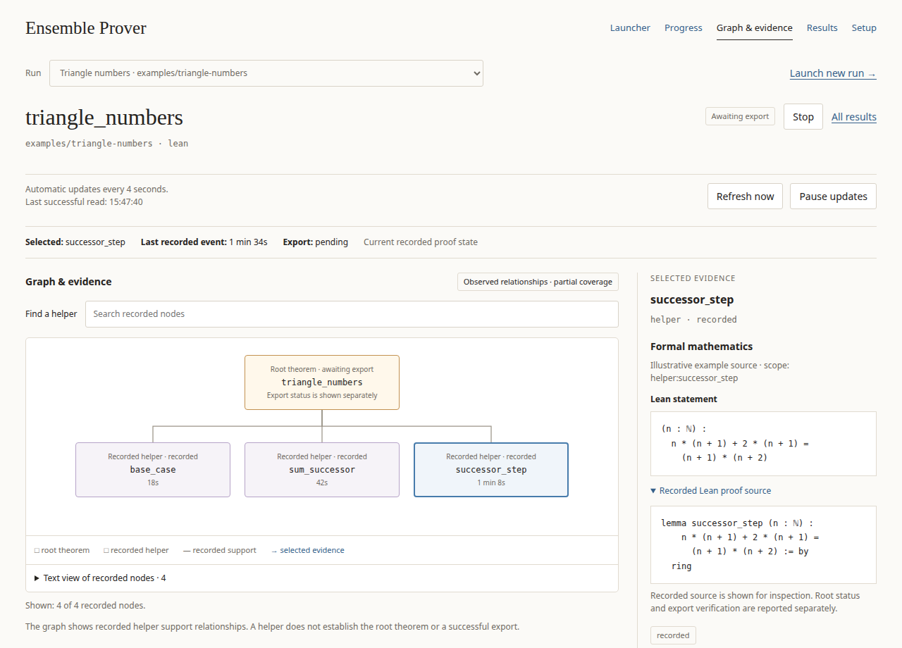
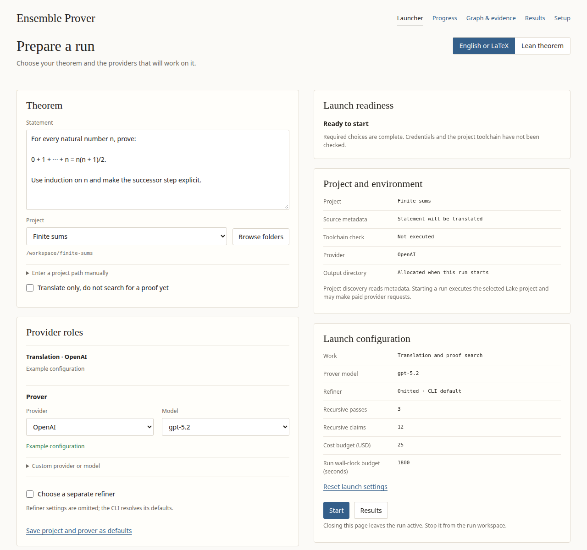
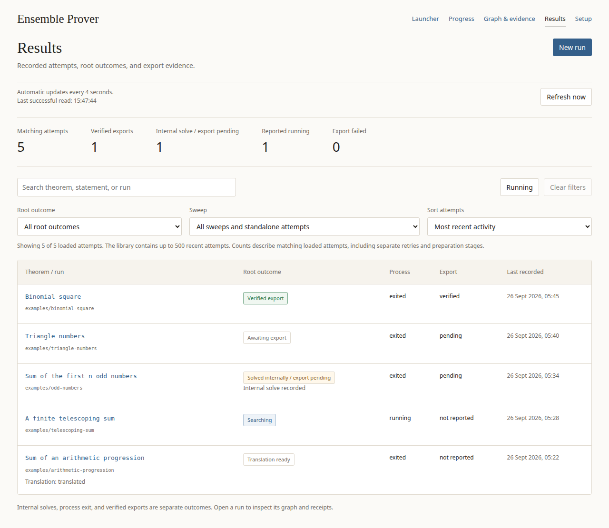

<h1 align="center">Ensemble Prover</h1>

<p align="center"><strong>From mathematical claims to Lean-checked proofs.</strong></p>

<p align="center">
  Autonomous proof search · Lean 4 verification · Local browser workspace
</p>

<p align="center">
  <a href="#quick-start">Get started</a> ·
  <a href="#your-proof-workspace">Explore the UI</a> ·
  <a href="#how-it-works">How it works</a> ·
  <a href="#results">Results</a> ·
  <a href="#documentation">Documentation</a>
</p>

Ensemble Prover coordinates language models, recursive lemma planning,
mathematical retrieval, proof repair, and Lean verification in an autonomous
proof-search system. Give it a theorem or an English claim, follow the work in
your browser, and inspect the formal mathematics behind recorded progress.

**257+ Putnam problems with saved solutions—and counting.**

[Results and evaluation scope](#results)

[](docs/assets/ui-proof-inspector.png)

<p align="center"><em>Select a helper. Read its statement. Inspect its proof.</em></p>

The screenshots show the actual interface with illustrative example records.
The binomial-square export uses a supplied proof checked by the export verifier.
Click an image to view it at full size.

**Version 1.16 · Research preview** · Linux · MIT license

<a id="local-browser-interface"></a>

## Your proof workspace

### 1. Configure the attempt

Start from English or LaTeX, or choose a Lean project, file, and theorem.
Select your prover and optional refiner, set search and budget controls, and
review the configuration before starting. Project discovery and a launch
checklist help you get the inputs right.

[](docs/assets/ui-launcher.png)

### 2. Follow the mathematics

Watch recorded progress in the graph and timeline. Select a helper or root to
inspect its recorded Lean statement and available proof source. Search nodes
and recent events, pause automatic updates, or follow a sequential sweep as
it moves between attempts.

The inspector connects progress to readable formal mathematics. A helper's
acceptance, an internal root solve, and a verified export remain distinct
outcomes throughout the workspace.

### 3. Review the results

Search saved attempts, filter by sweep or outcome, and reopen the work that
matters. Results keep process status and proof status visible together.
Closing the browser leaves an attempt running; owned attempts support a
confirmed cooperative stop.

[](docs/assets/ui-results.png)

[Explore the browser interface →](interface/README.md)

## How it works

**Plan, prove, check, and refine.** Ensemble Prover develops supporting
mathematics, uses Lean feedback to repair candidates, and brings checked
helpers back into work on the original theorem.

| Capability | What it enables |
| --- | --- |
| **Recursive proof search** | Decompose difficult work into scoped helper lemmas, explore alternatives, and assemble a root proof. |
| **Lean feedback and repair** | Check candidate terms and tactics against the target project, then use concrete failures to guide the next attempt. |
| **Retrieval and reuse** | Find relevant declarations and recover checked helpers from compatible saved work. |
| **Research when work stalls** | Investigate alternative arguments, formalize candidates, and return proof feedback within the configured workflow and budgets. |
| **Model coordination** | Configure prover, refiner, and planner roles; use parallel proof samples and explicit time, call, and API cost controls. |
| **Persistent work** | Retain checkpoints, artifacts, and recorded progress for inspection and supported recovery workflows. |

English input first passes through formalization. Longer developments can use
resumable campaigns to build definitions and supporting theorems across files.
Autonomous research can investigate arguments and counterexamples before
handing candidates to formalization and proof search.

**The proof certificate is a verified export.** A helper or internal solve is
progress toward it. Lean verifies the formal statement; review generated
statements and definitions to check that they express your intended mathematics.

## Quick start

The browser workspace requires **Linux**, standard **CPython 3.11 or 3.12**, and
**Node.js 22.20+ (22.x), 24.12+ (24.x), or 26+** to build the page. Node is not
needed while serving the built UI.

```bash
git clone https://github.com/graviterra/ensemble-prover.git
cd ensemble-prover

python3.11 -m venv .venv
.venv/bin/python -m pip install -r requirements-interface.txt
.venv/bin/python -m pip check
npm --prefix interface/web ci
npm --prefix interface/web run build

.venv/bin/python -m interface.service --control
```

Open **[http://127.0.0.1:8765](http://127.0.0.1:8765)**. Use `python3.12` in the
virtual-environment command if preferred. Omit `--control` for read-only browsing.

To start proof work, supply a **compatible, built Lean/Lake project** and model
access. Install Lean and Lake using the [official guide](https://lean-lang.org/install/)
and your project's `lean-toolchain` pin. Lean, Mathlib, and benchmark datasets
are supplied separately.

For browser launches, export provider credentials in the service shell, or use
an existing supported subscription CLI sign-in. The service does not load `.env`.
The browser's English-to-Lean translator uses the OpenAI API and needs
`OPENAI_API_KEY`, including when proof search uses a subscription backend.
Mini supports API providers and Codex or Claude Code subscription backends;
available transports vary across formalization and research workflows.

The workspace runs on localhost with trusted users, projects, and state
directories. Keep it local; it is not a shared network service.

[Browser setup and controls](interface/README.md) ·
[CLI quick start](docs/CLI_QUICKSTART.md) ·
[Codex setup](docs/CODEX_SUBSCRIPTION_BACKEND.md) ·
[Claude Code setup](docs/CLAUDE_CODE_SUBSCRIPTION_BACKEND.md)

<a id="run-the-prover"></a>

## Run from the terminal

For a Lean theorem in an existing project:

```bash
.venv/bin/python -m ensemble_prover.mini_prover \
  --lean-file /path/to/Target.lean \
  --theorem-name MyNamespace.target \
  --project-path /path/to/lake-project \
  --import Mathlib --prover openai
```

Use `--help` for the options in your checkout. For a CLI-only installation and
examples covering natural language, campaigns, research, and sweeps, see the
[CLI quick start](docs/CLI_QUICKSTART.md).

<a id="choose-a-workflow"></a>

## Choose your workflow

| Start with | Use | Guide |
| --- | --- | --- |
| A Lean theorem | Browser or Mini CLI | [Theorem projects](docs/USER_GUIDE.md#4-prepare-an-arbitrary-theorem-project) |
| An English or LaTeX claim | Browser or natural-language CLI | [Single-claim formalization](docs/USER_GUIDE.md#18-formalize-one-natural-language-claim) |
| Longer mathematical notes | Formalization campaign CLI | [Multi-file developments](docs/USER_GUIDE.md#19-run-a-multi-file-formalization-campaign) |
| A problem to investigate | Autonomous research CLI | [Research and proof feedback](docs/USER_GUIDE.md#21-run-autonomous-mathematical-research) |
| An existing Mini run | `./research /path/to/run` | [Research from saved work](docs/CLI_QUICKSTART.md#start-research-from-a-saved-run) |
| A collection of PutnamBench problems | Sweep script | [Sequential sweeps](ensemble_prover/PUTNAM_SWEEP.md) |

Natural-language formalization and autonomous research are experimental.
Research arguments and translation results require further checking before
they can support a proof claim.

## Results

| Distinct problems with saved solutions | Listed on PutnamBench |
| :---: | :---: |
| **257+ distinct Putnam problems** | **65 problems** |
| Cumulative archive · September 26, 2026 | Public metadata checked · September 26, 2026 |

The cumulative count combines models, configurations, and budgets and does not
establish a controlled benchmark solve rate. Historical artifacts can have
different axiom and verification records; a saved solution alone is not a
current-policy proof certificate. The listed 65 are included in this
cumulative tally. PutnamBench's public metadata describes their proof bundle as submitted
privately for independent verification; that entry does not confirm completed
independent acceptance.

[Results, problem identifiers, and evaluation scope](docs/RESULTS.md) ·
[PutnamBench leaderboard](https://trishullab.github.io/PutnamBench/leaderboard.html)

## Documentation

| Learn about | Start here |
| --- | --- |
| Browser installation, controls, storage, and limitations | [Interface guide](interface/README.md) |
| Terminal commands for proving, formalization, and research | [CLI quick start](docs/CLI_QUICKSTART.md) |
| Providers, project setup, search, and troubleshooting | [User Guide](docs/USER_GUIDE.md) |
| Time, provider-call, and API cost controls | [Budgets](docs/USER_GUIDE.md#7-set-time-and-cost-boundaries) |
| Proof status, exports, and inspection | [Reading results](docs/USER_GUIDE.md#11-determine-whether-a-run-succeeded) · [Exports](docs/USER_GUIDE.md#12-standalone-exports-and-proof-graphs) |
| Checkpoints, interruption, and resumption | [Recovery guide](docs/USER_GUIDE.md#13-replay-and-interruption-behavior) |
| Research execution and formalization handoffs | [Research guide](ensemble_prover/research_claims/DISCOVERY.md) |
| Local execution, privacy, and vulnerability reporting | [Security](SECURITY.md) |

## Cite this work

> Reale, M. (2026). *Ensemble Prover* (Version 1.16) [Computer software]. Graviterra.

```bibtex
@software{reale2026ensembleprover,
  author       = {Reale, M.},
  title        = {{Ensemble Prover}},
  year         = {2026},
  version      = {1.16},
  organization = {Graviterra},
  url          = {https://github.com/graviterra/ensemble-prover}
}
```

Identify the version or commit used for reproducibility.
[CITATION.cff](CITATION.cff) provides machine-readable citation metadata.

Ensemble Prover is licensed under the MIT License. See [LICENSE](LICENSE).
