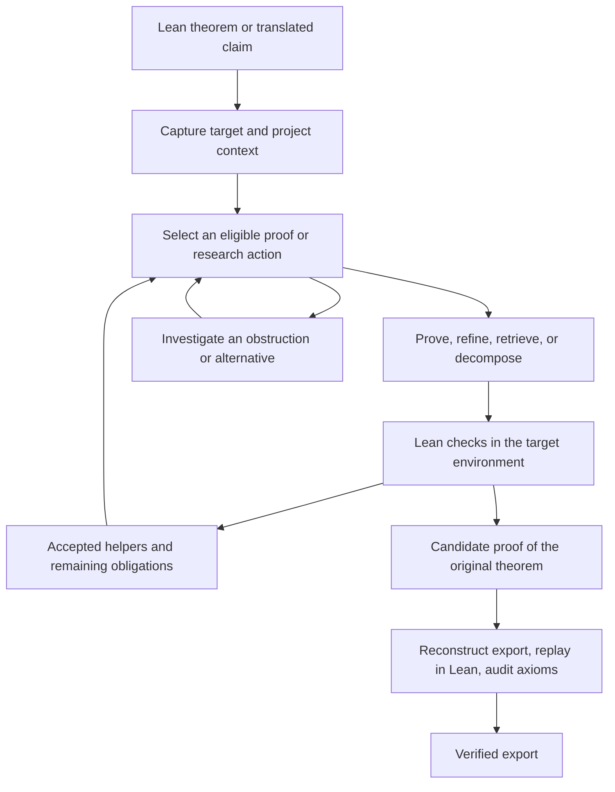

# Proof search and mathematical research

Ensemble Prover combines language-model reasoning with a persistent collection
of proof obligations and Lean checks. The original theorem remains the target
while the system develops lemmas, tries tactics, investigates obstacles, and
attempts to assemble a complete proof.

For executable setup examples, use the [CLI quick start](CLI_QUICKSTART.md).
For model choices, see [providers and roles](providers.md).
For verification reuse and resource accounting, see
[Lean contexts and closure scheduling](lean-contexts.md).

## From input to checked result



The system preserves the theorem's hypotheses and ambient definitions. An answer
discovery workflow first proposes an explicit answer and admits the resulting
statement; it must then prove that statement. A generated answer is not assumed
equal to a hidden benchmark answer. See
[answer discovery and certified rediscovery](USER_GUIDE.md#questions-with-an-unknown-answer).

Answer review receives a Lean-elaborated statement whose meaning is checked
against the original source. Generated internal proof terms can be reconstructed
into a compact rendering only if independent Lean replay and source equivalence
both succeed. If the validated rendering still exceeds 64,000 characters, answer
preparation stops and saves the full rendering in its artifacts. It does not
truncate the statement or classify the proposed answer as mathematically wrong.

## The search lanes

| Lane | Purpose | How to control it |
| --- | --- | --- |
| Prover conversation | Develop and check a proof using mathematical and Lean feedback | `--max-prove-turns` |
| Refiner conversation | Continue the transcript after the prover stalls, potentially with a different model | `--refiner`, `--refiner-model`, `--max-refine-turns` |
| Recursive planning | Propose scoped helper obligations and root assembly routes | `--mini-recursive-*` |
| Recursive helper proving | Allocate child sessions to selected obligations | `--recursive-helper-*` |
| Proof-state tactics and declaration application | Try concrete steps on active Lean goals | `--proof-state-child-*`, `--proof-state-decl-application-limit` |
| Root tactics | Try deterministic candidates across resumable service slices | `--root-tactic-prepass`, `--startup-root-fast-lane` |
| Formal-state search | Explore tactic alternatives over multiple resumable quanta | `--formal-state-search-*` |
| Parallel samples | Run independent proof conversations with shared run limits | `--parallel-samples`, `--parallel-temps` |
| Research recovery | Investigate mathematical obstacles and return arguments to proof work | `--autonomous-research`, `--frontier-research` |

Child sessions have their own statements, contexts, and resource allocations.
Success on a child does not imply success on the root. Parent and child work
share the governing run limits; recursion does not create additional spending
authorization. The refiner and planner are model roles, not independent theorem
verifiers.

New runs impose no cumulative count limit on prover or refiner turns, recursive
passes, helper claims, claim variants, or recursive helper turns. The count
options use `-1` for unlimited work; positive values retain the requested limit.
Zero prover/refiner turns or recursive passes disables that lane. Recursive
depth and per-node helper attempt limits use zero for unlimited work. Explicit
cost and elapsed-time budgets still govern the run, and saved checkpoints retain
their recorded allocations.

Scheduling batches remain finite so pending work can be saved and other work
can run. Deterministic root, child, and recursive portfolios default to `-1`,
retaining all generated candidates across service slices; zero disables that
portfolio, and positive values impose an explicit cap. Child-goal and declaration
batch widths limit each dispatch while retaining pending work. Typed residual
batches are checked and admitted atomically without a default goal-count cutoff.
Recursive children yield only after a settled action and resume the same proof
state; pending provider work is retained. Repeated identical plans and already
checked deterministic candidates do not create new work. Accepted helper growth
does not itself terminate search after a fixed number of turns, and fresh
mathematical progress can continue a
repair chain without a default depth cutoff.

Helpers may carry useful automation through attributes and instances as well as
explicit references. Accepted source must preserve the Lean environment that
makes the proof work, including complete quoted or primed declaration names.
Export reconstruction and fresh checking remain the final check on assembly.

## Progress toward the original theorem

A route describes how named obligations are intended to support the root.
Scheduling favors unresolved prerequisites on viable routes, obligations shared
by multiple routes, and ready root assembly. It retains an exploration allocation
for mathematics whose eventual use is not yet known.

Suppose a checked reduction establishes `A ∧ B → R`. If `B` has already been
proved, proving `A` can complete that reduction. Proving an unrelated lemma does
not have the same immediate contribution. Alternative reductions keep their
own premises; the scheduler cannot mix assumptions from incompatible routes.

Completing a pre-existing obligation counts as progress when current verified
helper evidence certifies its unchanged target. This includes tighter bounds,
residual cases, and prerequisites represented explicitly in the graph. Completion
credit survives restart; renaming or reopening the same proposition cannot earn
it repeatedly. A claim of usefulness alone does not establish this connection.

The dossier retains the full lemma collection and remaining obligations. When
the provider can use `read_verified_helpers`, prompts select complete helper
signatures within a presentation budget. Exact lookup, text filtering, and
pagination expose the rest in the same validated Lean context. Providers without
that tool receive the full signature view. Selection never removes dependencies
from proof replay.

Lemma purpose and compact mathematical failure history remain attached to graph
records across checkpoints. Failure history records the attempted target and
context, and guides future search without declaring a target false or forbidding
another attempt. Restoring accepted helpers independently checks their complete
ordered declaration batch before restoring proof authority.

There are two different evidence levels:

- Native Mini route contracts record intended requirements and assembly
  relationships. Their existence does not prove the proposed implication.
- The adaptive research frontier can use revalidated checked reductions and
  proof exports. An informal route description cannot receive that authority.

The system also observes whether a helper constant occurs in a subsequently
accepted elaborated proof, including through local dependencies. Merely putting
a helper in the replay context does not count as use. These observations are
scoped and bounded, not lifetime totals or a proof that the helper was necessary.
Missing observations mean unknown; speculative discoveries are not penalized
simply because they have no recorded consumer yet.

The browser's **Mathematical focus** panel explains the selected approach,
blocking obligation, recorded dispatch reason, and last expensive completed
action. It describes recorded decisions rather than predicting future work.
Priority is always a heuristic. It cannot certify an implication, reject a
mathematical claim, or grant extra budget.

## What Lean establishes

Lean checks candidate proofs against the active statement and project context.
The contract analyzer also uses elaborated terms for binder dependencies,
bound-variable identity, and requested definitional-equality comparisons. A
display name is not a mathematical identity, and a renamed bound variable need
not denote a different theorem.

Structural identity, definitional equality, and a proved implication are distinct.
The system does not decide arbitrary logical equivalence. Some source parsing and
context reconstruction remain; an unavailable or timed-out semantic check must
remain unknown rather than establish equality or justify dropping a hypothesis.

Checked evidence is tied to its executable source and environment. Changing a
compiled statement variant or relevant context requires current evidence before
reuse. Root proof acceptance and export include axiom auditing; the ordinary
checker allows `propext`, `Classical.choice`, and `Quot.sound`, not arbitrary new
axioms or unfinished proofs.

## Formal-state search

Formal-state search is **off by default**. Enable it explicitly for a run:

```bash
.venv/bin/python -m ensemble_prover.mini_prover \
  --lean-file /path/to/Target.lean --theorem-name MyNamespace.target \
  --project-path /path/to/lake-project --prover openai \
  --formal-state-search
```

It keeps an active beam and a saved reserve of alternative proof states. Depth
and backtracking windows renew across scheduling quanta; default candidate and
retry settings impose no lifetime count limit. Explicit positive candidate,
retry, and non-improvement limits remain available. It can request
goal-conditioned tactics from the configured model and retains unchecked
candidates across yields. Lean checks the transitions; fewer displayed goals
alone is not a root proof.

The total quantum default is 120 seconds. The separate operation timeout defaults
to zero, meaning no extra formal-search cancellation deadline is imposed on an
in-flight Lean operation; ordinary Lean and run limits still apply. Quanta can
yield between steps rather than behaving as exact wall-clock cutoffs. Consult
`--help` before tightening individual operation deadlines.

Model tactic generation inherits the role's reasoning and output capacity.
`--formal-state-search-provider-max-tokens 0` selects that automatic capacity;
a positive value is an explicit phase limit. This lane spends Lean time and may
spend model calls. It is useful to evaluate under matched budgets rather than
assuming that enabling it improves every problem.

## Counterexamples and failed approaches

Falsification can probe suspected false targets and helper claims with bounded
examples and available engines. An unsuccessful tactic, timeout, numerical
observation, or external solver answer is not a proof of falsity.

Authoritative refutation requires a Lean proof of the exact claim's negation,
independent replay, and axiom auditing. The context, quantifiers, and hypotheses
must match. Refuting a helper can invalidate that route without refuting the
original theorem. Refuting an admitted answer candidate can support explicit
`--rediscover-from`; mere failure to find a proof cannot.

`--no-mini-falsification` disables this search lane. The
`--mini-falsification-*` controls bound instance checks and engine work. Optional
SMT or numerical dependencies are not part of the minimal installation; their
absence must not be interpreted as a mathematical result.

## Research and alternative approaches

Automatic research is enabled for new Mini runs. It can investigate an objection
or stalled route while ordinary proving continues, then deliver results at a
scheduler boundary. It borrows from the existing time, action, and provider
allowances. Research observations do not count as checked proof progress.

The separate discovery workflow supports longer investigations, literature
lookup, source and PDF inspection, independent argument reviews, and optional
isolated Python experiments. With a built Lean project it can alternate research,
formalization, Mini proof work, and checked export. With no project it remains a
research workflow. See [discovery](../ensemble_prover/research_claims/DISCOVERY.md)
and [strategy recovery](../ensemble_prover/research_claims/STRATEGY_RECOVERY.md).

Frontier research is a separate, experimental allocation policy:

| `--frontier-research` | Behavior |
| --- | --- |
| `off` | Default; retain the ordinary research allocation policy |
| `observe` | Record hypothetical allocation decisions without changing dispatch, prompts, or tools |
| `adaptive` | Maintain explicit approaches and questions and change allocation within existing authorization |

Add `--frontier-research adaptive` to a new Mini invocation or to
`research_claims discovery init`. Discovery requires strategy recovery for this
policy. Resume retains the saved mode. The policy neither enables formal-state
search nor turns on experiments.

Adaptive work preserves approach identity and continuation context. It gives
bounded follow-through to substantive, independently assessed research progress
and reserves opportunities for alternatives. A useful investigation asks a
specific question: whether a theorem's hypotheses fit, whether a proposed bound
has a counterexample, or which of two approaches survives an obstruction.
Successful tool execution alone does not answer that question.

Native Mini uses these allocations to produce advice for the existing proof
session. Its helper snapshots remain advisory to the research frontier; they do
not automatically become checked reductions. Discovery obtains formal frontier
evidence through its revalidated proof exports.

## Defaults and opt-ins

| Feature | New Mini CLI runs |
| --- | --- |
| Recursive planning, helper proving, proof-state scheduling | Enabled |
| API/declaration search and federated mathematical retrieval | Enabled |
| Falsification and verified-helper cache | Enabled |
| Automatic research recovery | Enabled |
| Mini theory | `build` |
| Helper promotion into Mini theory | Opt-in |
| Formal-state search and cold root prepasses | Opt-in |
| Frontier research allocation | `off` |
| Mathematical memory | `off` |
| Refiner and planner escalation | Require explicit configuration; escalation defaults to `off` |
| Parallel samples | One |

Saved runs retain their settings. Browser controls and standalone research or
formalization workflows have their own configuration surfaces. These defaults
are not claims of optimal settings for unsolved mathematics.
