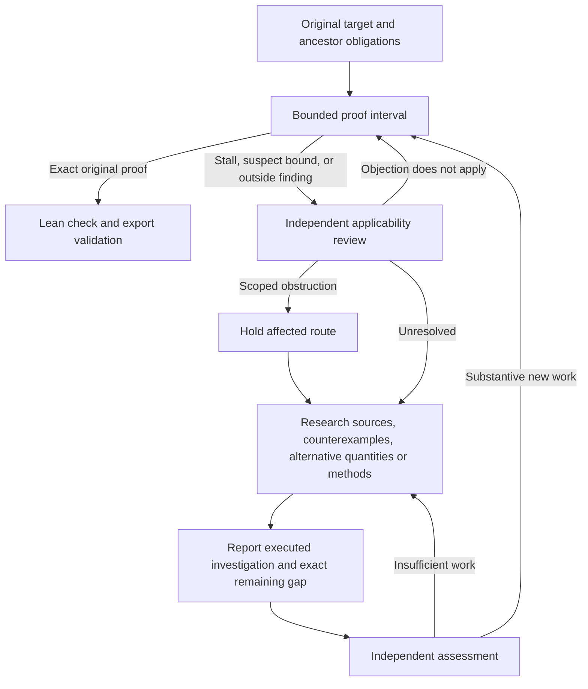

# Strategy recovery: challenge the route, continue the research

The discovery controller now tracks the mathematical obligations behind a proof
attempt, limits how long one route can monopolize work, commissions independent
reviews, and funds other investigations. A successful helper is useful only if it
advances the ancestor bound that the original problem actually requires.

**A strategy objection, stalled interval, failed experiment, or exhausted local
proof attempt does not terminate the research run.** It returns work to research.
The saved overall request and time authorization, user cancellation, verified
original-root completion, and existing integrity/operational failures still apply.
This does not promise unlimited provider access or indefinite execution.

Recovery is enabled by default for **new discovery CLI runs**. Standalone Mini
runs acquire these controls when orchestrated by discovery. An existing Mini
process does not acquire them through a code change; stopped runs can be adopted
into a fresh discovery ledger.

## Recognize a blocked proof route

A helper can be true while an ancestor bound required by the proposed proof is
false. For example, improving the error estimate in a counting argument cannot
repair a counting claim contradicted by an applicable construction. The controller
keeps those dependencies explicit, accepts outside findings, and assigns an
independent review before redirecting resources. Refuting an auxiliary claim
does not by itself settle the original problem.

## Start with an immutable original Lean target

Use the repository Python environment and an already built Lake project:

```bash
python -m ensemble_prover.research_claims discovery init runs/research/problem \
  --lean-file /path/to/Problem.lean --theorem Problem.target \
  --project-path /path/to/built-lake-project \
  --provider codex --model gpt-6-astra --review-model gpt-6-astra \
  --max-requests 200 --max-seconds 14400 --concurrency 4

python -m ensemble_prover.research_claims discovery run runs/research/problem
```

Initialization makes no model calls. It compiles a capture of the exact original
Lean proposition in the original environment. Candidate imports and instances
cannot redefine that proposition. Final acceptance requires a Lean-checked
wrapper proving this captured proposition, or its negation, and a verified export
closure. A model approving a weaker formalization cannot bypass that check.

For a prose-only problem, use `--problem problem.txt`. With no original Lean pin,
alignment of the formal statement to prose remains model-reviewed. It is not a
kernel certificate of the prose's meaning. Omitting `--project-path` gives
research-only execution, including reviews and literature tools.

## Adopt a stopped Mini run

This command creates a **new** ledger. It never resumes the old scheduler or
trusts the old helper proofs without rechecking them.

```bash
python -m ensemble_prover.research_claims discovery init runs/research/recovery \
  --adopt-mini-run /path/to/stopped-mini-run \
  --provider codex --model gpt-6-astra --review-model gpt-6-astra \
  --max-requests 200 --max-seconds 14400 --concurrency 4

python -m ensemble_prover.research_claims discovery subjects runs/research/recovery
```

The importer verifies the original source hash, preserves checkpoint and metadata
bytes, records prior accounting, and registers saved mathematical contracts. It
reads JSON rather than executing a checkpoint deserializer. Missing formal context
stays explicitly unknown. Saved statements in different formal contexts remain
separate candidate obligations; importing them does not create proof receipts.

The new limits authorize the new research run; they do not erase the recorded
cost of the old one. Adoption currently rejects standalone supporting source
directories outside the saved Lake project. Put such modules into a built project
before adopting; silently discarding their environment would be unsound.

### Supply the outside finding before or during research

Use `subjects` to select the exact issued handle for the disputed claim.
Write a complete applicability argument explaining the quantifiers,
hypotheses, error size, and remaining uncertainty. Then submit it with the primary
source bytes:

```bash
python -m ensemble_prover.research_claims discovery evidence runs/research/recovery \
  --subject SUBJECT_HANDLE --scope claim_contradiction \
  --argument applicability.txt --source primary-source.pdf

python -m ensemble_prover.research_claims discovery run runs/research/recovery
```

`evidence` makes no model calls. The running controller picks it up durably.
An independent review decides whether the source applies to the exact claim.
With concurrency one, the current proof interval is bounded so review can follow;
raw evidence intake itself does not preempt work or declare a refutation.

Use `method_barrier` for a limitation specific to an issued method, and
`unsupported_bridge` for an unjustified implication. Supply the exact `--method`
handle for these scopes. `allocation_exhausted` requests investigation without a
mathematical falsity claim. An appeal adds new arguments and names earlier review
IDs using repeated `--supersedes REVIEW_ID`; it does not erase unlisted dissent.

## How the controller changes behavior



### Mathematical memory and selective redirection

- Exact statement plus formal context identifies an obligation. Parent links expose
  a dubious ancestor even when Mini is proving a much smaller helper.
- Claim-wide holds affect dependent work. Method-specific holds leave other methods
  eligible. Shared helper work uses one request pool; releasing one consumer does
  not abandon another live consumer.
- Independent directed applicability reviews can establish that a held claim is
  still required by a rephrased route. Similar wording alone does not prove that
  two contexts or claims are equivalent.
- Holds govern resource allocation. Only Lean-checked original-root exports can
  establish formal success. Objections, finite experiments, reviewer confidence,
  and local helper counts cannot produce proof authority.

### Actual exploration and progress

A new title or `finish` message is insufficient to renew a stalled route.
`report_investigation` records the method, actual derivation or checks, first
uncertain inference, evidence artifacts, and remaining gap. A separate worker
assesses whether substantive exploration occurred. The assessment is bound to
that producer, report, and current requirement; replaying an old report cannot
purchase another interval.

`request_progress_review` cites artifacts produced by admitted work. A separate
reviewer checks relevance to the precise ancestor obligation and quantitative
requirements. One approved result earns credit once. Active approvals survive
shared-consumer release and process restart. New work makes obsolete reviews
ineligible to reset its accounting.

The controller exposes `record_bottleneck`, `lookup_strategy_subject`,
`request_strategy_review`, `request_implication_review`, and progress/investigation
actions in researcher context. Mini has `request_strategy_review` and
`read_strategy_artifact` tools, including when ordinary proof tools were disabled.

### Literature and experiments

Researchers and reviewers can search Crossref bibliographic metadata, fetch
public primary sources, and render numbered PDF pages from original bytes.
Rendered page images reach both image-capable API requests and the Codex CLI.
Sources retain URL, content hash, content type, and provenance. Unavailable search,
metadata-only coverage, and uninspected documents remain unknown.

Crossref is a bibliographic discovery channel, not comprehensive web search.
Inspecting a known source is stronger coverage than finding no relevant metadata.
Optional existing Python experiments require `--experiments`; a finite experiment
never becomes a certificate for an infinite theorem.

### Continuous scheduling and bounded context

If all programs finish or wait without runnable work, recovery creates another
research investigation while overall authorization remains. Delayed retries do
not block ready jobs. An uncooperative provider tail loses dispatch authority
before cancellation; its late output is retained as an accessible candidate.
Fresh local verification may still accept a valid late original-root proof.

Large immutable Lean environment snapshots are stored separately from the changing
scheduling record. Default reads still verify and restore the complete configuration;
frequent scheduling checks do not reread all project-file metadata.

Research and Mini context use bounded working windows with exact artifact/page
retrieval. Short control outcomes such as `target_mismatch` remain visible.
Original arguments are archived, not replaced by generated summaries. Omitted
content must be retrieved before judging it. Research context overflow reduces
the window and resumes within the same authorization.

## Controls and inspection

| Option | Default | Meaning |
| --- | --- | --- |
| `--strategy-interval-requests` | 10 | Maximum provider dispatches per proof allocation, shared by nested work. |
| `--strategy-interval-seconds` | 600 | Maximum wall time per proof allocation. |
| `--strategy-reserve-requests` | 4 | Preserve capacity for research and review before new proof exposure. |
| `--strategy-reserve-seconds` | 60 | Preserve time for returning to research. |
| `--strategy-max-no-progress` | 2 | Completed intervals without relevant progress before another investigation is required. |
| `--no-strategy-recovery` | off | Explicit compatibility mode for new unpinned discovery runs. |

Proof intervals also respect `--proof-quantum-s`, operation timeouts, and the
original total limits. A zero-dispatch settlement interval can recheck saved proof
work after provider budget exhaustion; it grants no new model requests and does
not count as research stagnation. A forked child cannot reuse its parent's lease.

```bash
python -m ensemble_prover.research_claims discovery status DIRECTORY
python -m ensemble_prover.research_claims discovery subjects DIRECTORY
python -m ensemble_prover.research_claims read-artifact DIRECTORY SHA256 --output artifact.txt
```

New ledgers use schema 7. Explicit `upgrade DIRECTORY` migrates schemas 1–6 without
resetting counters or authorizing recovery on old ledgers. Schema 6 retains its
closed-loop settings. Older clients reject the new schema. The Python initializer
keeps `strategy_recovery=False` as its compatibility default; enable it explicitly
when using the API rather than the CLI.

### Recovery and cleanup behavior

Malformed strategy actions receive correction feedback and remain resumable.
Repeated objections retain their evidence identity, and an assigned progress
review keeps the exact snapshot its reviewer was given. Identical evidence can
earn progress credit only once, including across concurrent allocations and
restart.

Adoption preserves separate contracts for each saved statement and formal
context. An unavailable context carries checkpoint/session provenance; it cannot
inherit another session's context or be treated as an explicitly empty context.

A factory can replace a retired transport while the old task remains fenced.
Slow client disposal receives a bounded wait and cannot occupy a research
worker. An independently accepted late proof survives subsequent incomplete,
yielded, timed-out, or cancelled attempts of the same program.

After authorized execution ends, the strategy CLI gives asynchronous cleanup
one shared 0.5-second grace period, including cleanup tasks created by other
cleanup tasks, then closes its owned event loop. This preserves user
cancellation and existing total limits. Library callers retain ownership of
their event loop. The bound covers asynchronous tasks that yield control;
Python cannot forcibly stop arbitrary blocking threads or synchronous code.

## Evidence and limits

This implementation has scripted control-flow tests, adversarial replay/restart
and network tests, separate-process Codex attachment tests, and actual Lean tests
for original-target identity and final export. These establish implementation
behavior. They do not establish a measured improvement in autonomous theorem
solving. Independent model reviews can still
be wrong; their allocation decisions are scoped, auditable, and appealable.
